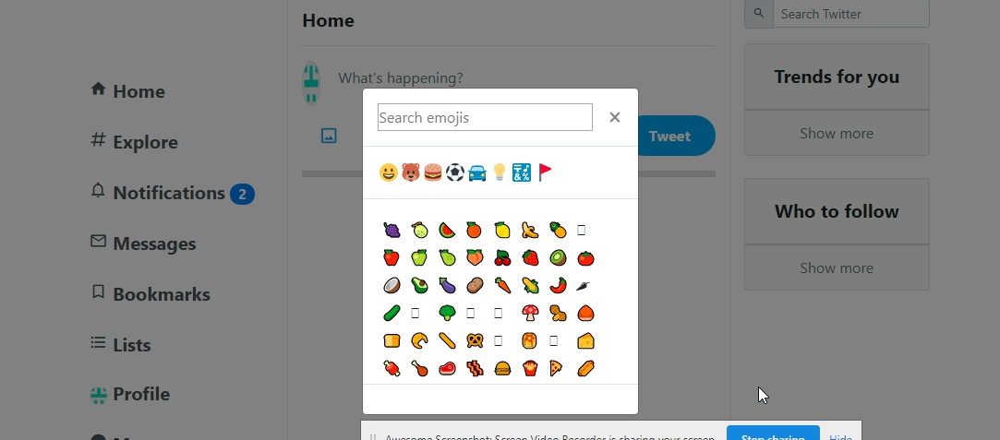

# Lab 6

## Using .filter() in Assignment #1

The filter function takes an array and creates a new array based on a boolean expression. If the expression evaluates to true then that element becomes part of the new array, but if it evaluates to false, it does not. The original array is not transformed, but the new array could contain fewer elements.

You can see the complete documentation at the [MDN website ](https://developer.mozilla.org/en-US/docs/Web/JavaScript/Reference/Global_Objects/Array/filter).

In Assignment 1, I used the filter function with the emoji functionality.

The first time I used filter it was to search through the different emoji icons. I took the data received from fetching from https://unpkg.com/emoji.json@12.1.0/emoji.json, assigned it to an array variable called emojis, and then filtered that array so only those emoji icons that matched the search term, which was assigned to the "search" variable, were displayed.

```javascript
let filteredEmojis = emojis
  .filter(emoji => emoji.name.includes(`${search}`))
  .map(
    (emoji, index) =>
      `<div data-index=${index} data-name="${emoji.name}" class="emoji">${emoji.char}</div>`
  )
  .join("");
```


The other times I used the filter function was on each of the emoji categories so that if one category was clicked, only the emojis of that particular category would be displayed. Because each individual emoji had a category assigned to it, I filtered my emojis array so that if the emoji contained the category word then that emoji would be assigned to thew new array, but if it didn't match it wouldn't.

As seen in the code below, if the user clicked on the Smileys category then any emojis which had "Smileys" as part of their category name would pass the conditional testing and be assigned to the new array. Then the results would be mapped out and only the "Smileys" emojis would be displayed on the screen.

```javascript
function searchSmiles(e) {
  e.preventDefault();

  const smiles = emojis
    .filter(emoji => emoji.category.includes("Smileys"))
    .map(
      (emoji, index) =>
        `<div data-index=${index} data-name="${emoji.name}" class="emoji">${emoji.char}</div>`
    )
    .join("");
  emojimodalbody.innerHTML = smiles;
  emojimodalbody.scrollTop = 0;
}
```


